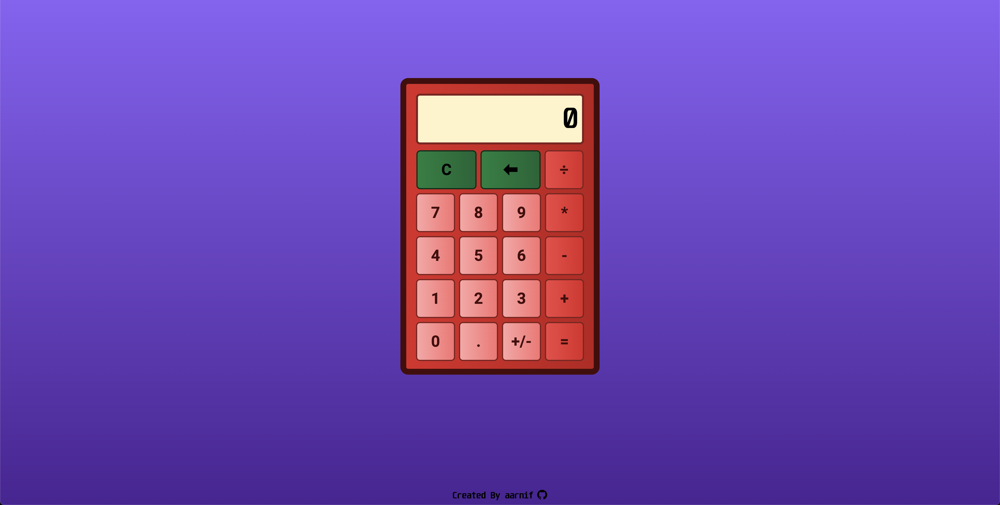

# Calculator

This is a simple calculator that can perform basic arithmetic operations.
The project is part of the [The Odin Project's](https://www.theodinproject.com/) Foundations Course.

## Features

- Users can perform basic arithmetic operations.
- Features a keyboard support.

## Live Preview

[Calculator](https://aarnif.github.io/odin-calculator/)

## Technologies

- HTML
- CSS
- JavaScript

## Image


Image of the page.

## Instructions

```
HTTPS - git clone https://github.com/aarnif/odin-calculator.git

SSH - git clone git@github.com:aarnif/odin-calculator.git

cd odin-calculator

open index.html with your browser
```
